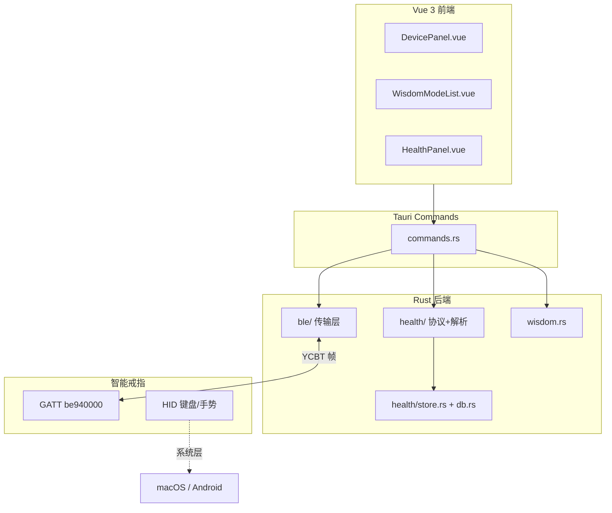

# HealthWear 开发路线图

> 仓库：https://github.com/tsin666/HealthWear-tauri  
> 健康模块细节见 [HEALTH_MODULES.md](./HEALTH_MODULES.md)

---

## 一、总览

### 1.1 项目定位

HealthWear 是基于 **Tauri 2 + Vue 3 + Rust** 的智能戒指桌面/移动端控制台，通过 BLE GATT 与 YCBT 协议与戒指通信。

| 能力 | 技术选型 |
|------|----------|
| UI | Vue 3 + TypeScript |
| 系统与 BLE | Rust（桌面 `btleplug`） |
| 健康数据 | SQLite 本地持久化 |
| 触控模式 | YCBT `setWitOnOff` 协议 |

### 1.2 目标架构



### 1.3 分层职责

| 层 | 目录 | 职责 |
|----|------|------|
| 传输 | `src-tauri/src/ble/` | GATT 连接、封包、CRC、通知 |
| 封包 | `ble/protocol.rs` | YCBT 帧构建与解析 |
| 常量 | `health/constants.rs` | `DATATYPE` 协议常量 |
| 解析 | `health/parse.rs` | 健康数据二进制解析 |
| 同步 | `health/sync.rs` | 历史数据拉取编排 |
| 存储 | `health/store.rs` + `db.rs` | SQLite 持久化 |
| 触控 | `wisdom.rs` | 6 种智慧模式 |
| API | `commands.rs` | Tauri invoke 接口 |
| UI | `src/components/` | 设备 / 触控 / 健康面板 |

---

## 二、阶段总表

| 阶段 | 名称 | 状态 | 产出 |
|------|------|------|------|
| **P0** | 工程初始化 | ✅ | Tauri 2 + Vue 3 脚手架 |
| **P1** | 协议文档 | ✅ | GATT UUID、DATATYPE、封包格式 |
| **P2** | BLE 传输层 | ✅ | 扫描/连接/GATT/封包/CRC |
| **P3** | 智慧触控 | ✅ | 6 模式 UI + `setWitOnOff` |
| **P4** | 健康数据（第一批） | ✅ | 心率/血氧/运动/血压 |
| **P5** | 健康数据（第二批） | ✅ | 睡眠 + 综合/体温/温湿度 |
| **P6** | 持久化 | ✅ | SQLite + CSV 导出 |
| **P7** | Android 真 BLE | 🚧 | btleplug + 权限 + 构建脚本 |
| **P8** | ECG | ⬜ | 波形展示 / 分析接口 |
| **P9** | 账号/云/OTA | ⬜ | 可选 |

图例：✅ 已完成 · 🚧 进行中 · ⬜ 未开始

---

## 三、分阶段说明

### P2 — BLE 传输层 ✅

- GATT：Service `be940000`，写 `be940001`，通知 `be940003`
- `build_frame` / `parse_frame` + CRC16
- `send_raw_command()` 通用接口

**待办**：MTU 分包、命令队列、Android BLE 后端

### P3 — 智慧触控 ✅

| protocolIndex | 模式 | 说明 |
|---------------|------|------|
| 1 | 短视频 | HID 手势 |
| 2 | 音乐 | 媒体键 |
| 3 | 阅读 | HID 翻页 |
| 4 | 拍照/录像 | 相机触发 |
| 5 | SOS | 系统求助 |
| 6 | 幻灯片 | HID 翻页 |

### P4–P5 — 健康数据 ✅

详见 [HEALTH_MODULES.md](./HEALTH_MODULES.md)。

### P6 — 持久化 ✅

- `rusqlite` + `health/db.rs`
- 同步后写入 SQLite，启动自动加载
- `export_health_csv` 导出 CSV

数据路径（macOS）：

```
~/Library/Application Support/com.soyetsin.healthwear/
  health.db
  exports/health_*.csv
```

### P7 — Android 真 BLE 🚧

- [x] 共享 `btleplug` 后端（桌面 + Android Rust 层）
- [x] 蓝牙权限与运行时授权（Manifest + MainActivity）
- [x] ProGuard keep 规则 + Gradle libs 目录
- [x] `scripts/setup-android-ble.sh` 构建 Java 库
- [ ] 真机验证 `pnpm tauri android dev`

详见 [ANDROID_BLE.md](./ANDROID_BLE.md)。

### P8 — ECG ⬜

- 原始波形拉取与 Canvas 展示
- 分析能力待评估

---

## 四、新功能开发流程（8 步）

```
Step 1  确认 DATATYPE 常量值
Step 2  分析二进制 payload 字段布局
Step 3  在 health/constants.rs 添加常量
Step 4  在 health/parse.rs 实现 parse_xxx() + #[test]
Step 5  在 health/sync.rs 实现 sync_xxx() + mock_xxx()
Step 6  在 health/store.rs + db.rs 增加存储
Step 7  在 commands.rs 注册 sync 分支
Step 8  更新 HealthPanel.vue + 真机验证
```

---

## 五、模块索引

| 功能 | Tauri 位置 | 状态 |
|------|------------|------|
| 智慧触控 | `WisdomModeList.vue` + `wisdom.rs` | ✅ |
| BLE 连接 | `ble/btleplug.rs` | ✅ 桌面 / 🚧 Android |
| 健康同步 | `health/sync.rs` + `HealthPanel.vue` | ✅ |
| 本地存储 | `health/db.rs` | ✅ |
| ECG | 待开发 | ⬜ P8 |
| 云同步/OTA | 待开发 | ⬜ P9 |

---

## 六、平台差异

### macOS + Q520 戒指

- 系统蓝牙可能识别为「Apple 无线键盘」
- 连接 App 前请在系统设置中断开该设备
- 智慧触控走 HID，健康数据走 GATT

| 能力 | 桌面 | Android |
|------|------|---------|
| BLE 连戒指 | ✅ | 🚧 需 setup 脚本 |
| 健康历史 | ✅ | 待接 |
| ECG | ❌ | 待评估 |

---

## 七、验证检查表

```bash
cd src-tauri && cargo test
cd .. && pnpm build
```

发版前：macOS 全流程（扫描 → 连接 → 触控 → 健康同步 → 导出 CSV）。

---

## 八、相关文档

| 文档 | 用途 |
|------|------|
| [ROADMAP.md](./ROADMAP.md) | **本文档** — 开发路线图 |
| [HEALTH_MODULES.md](./HEALTH_MODULES.md) | 健康模块协议与实现顺序 |
| [PROTOCOL.md](./PROTOCOL.md) | BLE / 触控协议速查 |

---

## 九、变更日志

| 日期 | 阶段 | 说明 |
|------|------|------|
| 2026-06-15 | P0–P4 | 工程、BLE、触控、4 项健康 |
| 2026-06-15 | P5 | 睡眠 + 综合/体温/温湿度 |
| 2026-06-15 | P6 | SQLite + CSV 导出 |
| 2026-06-15 | P7 | Android btleplug 后端 + 权限 + 构建脚本 |
